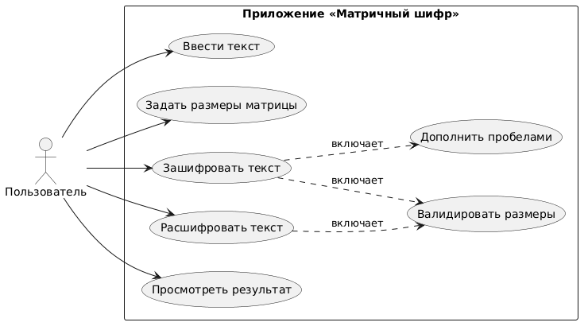
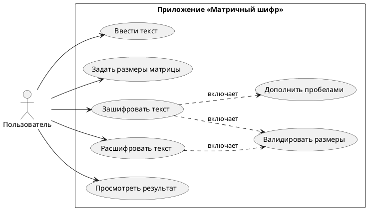

# Практическая работа №7. Отладка программы различными способами (Часть 2)

## Информация о проекте и разработчиках

| Поле | Значение |
|---|---|
| **Дисциплина** | Поддержка и тестирование программных модулей |
| **Работа** | Практическая работа №7, Часть 2 |
| **Тема** | Отладка программы встроенными средствами Visual Studio |
| **Разработчики** | Смолин Александр Сергеевич, Коскина Наталья Ивановна |
| **Группа** | 3ИСИП-423 |
| **Вариант** | **4 — Матричный шифр (Перестановочный)** |

---

## Описание предметной области

**Матричный шифр** — классический шифр перестановки, в котором исходный текст записывается в матрицу построчно, а считывается по столбцам. Ключом является пара `(rows, cols)` — размерность матрицы.

### Принцип работы

**Шифрование:**
1. Текст записывается в матрицу `rows × cols` по строкам слева направо.
2. Если текст короче `rows × cols`, он дополняется пробелами автоматически.
3. Шифротекст формируется чтением матрицы по столбцам сверху вниз.

**Пример** (`rows=3`, `cols=6`, текст `«ПРОГРАММИРОВАНИЕ»`):

```
Запись по строкам:
П Р О Г Р А
М М И Р О В
А Н И Е _ _

Чтение по столбцам:
П М А | Р М Н | О И И | Г Р Е | Р О _ | А В _

Результат: «ПМАРМНОИИГРЕРО АВ »
```

**Дешифрование** — обратная операция: шифротекст записывается по столбцам, читается по строкам.

### Реализованные методы

```csharp
/// <summary>
/// Шифрует текст матричным методом: запись по строкам, чтение по столбцам.
/// </summary>
/// <param name="message">Исходный текст.</param>
/// <param name="rows">Количество строк матрицы.</param>
/// <param name="cols">Количество столбцов матрицы.</param>
/// <returns>Зашифрованный текст длиной rows*cols.</returns>
public static string Encrypt(string message, int rows, int cols)

/// <summary>
/// Дешифрует текст матричным методом: запись по столбцам, чтение по строкам.
/// </summary>
/// <param name="cipher">Зашифрованный текст.</param>
/// <param name="rows">Количество строк матрицы.</param>
/// <param name="cols">Количество столбцов матрицы.</param>
/// <returns>Расшифрованный текст длиной rows*cols.</returns>
public static string Decrypt(string cipher, int rows, int cols)
```

---

## Диаграмма вариантов использования (UML Use Case)



**Описание вариантов использования:**

| ID | Вариант использования | Описание |
|---|---|---|
| UC1 | Ввести текст | Пользователь вводит исходный или зашифрованный текст |
| UC2 | Задать размеры матрицы | Пользователь вводит rows и cols |
| UC3 | Зашифровать текст | Запуск метода `MatrixCipher.Encrypt` |
| UC4 | Расшифровать текст | Запуск метода `MatrixCipher.Decrypt` |
| UC5 | Просмотреть результат | Отображение результата в поле ReadOnly |
| UC6 | Дополнить пробелами | Автоматическое дополнение текста до `rows×cols` |
| UC7 | Валидировать размеры | Проверка корректности rows, cols и длины текста |

---

## Средства отладки Visual Studio

В процессе отладки приложения были применены следующие встроенные средства Visual Studio:

### 1. Точки останова (Breakpoints)

Точки останова (`F9`) были установлены в методе `MatrixCipher.Encrypt` на ключевых строках:
- перед вызовом `message.PadRight(rows * cols)` — для проверки входных параметров;
- на строке формирования `result[index++]` — для контроля порядка считывания символов.

  


*До выполнения `PadRight`: переменная `padded` ещё равна `null`, `message` содержит исходный текст.*


*После выполнения `PadRight`: `padded` дополнен двумя пробелами до 18 символов.*

---

### 2. Окно «Локальные переменные» (Locals)

Окно локальных переменных использовалось для просмотра значений `text`, `rows`, `cols`, `result` непосредственно в момент выполнения:


*Начало выполнения `Encrypt`: `text="ПРОГРАММИРОВАНИЕ"`, `rows=3`, `cols=6`, `result=null`.*


*После завершения шифрования: `result="ПМАРМНОИИГРЕРО АВ "` — корректный результат.*

---

### 3. Окно «Видимые» (Autos) и «Контрольные значения» (Watch)

В окне **Видимые** отслеживались переменные `cols`, `result`, `rows`, `text`, `this` во время выполнения обработчика `EncryptButton_Click`:


*Видно: `result=null` до вызова `Encrypt`, `text="тест"`, `rows=2`, `cols=3`. Также видна работа Средств диагностики (потребление памяти ≈62 МБ).*

---

### 4. Просмотр массива result в DataTip

При наведении курсора на переменную `result` во время паузы на точке останова был развёрнут массив символов:


*Массив `result` типа `char[18]`: видны символы `П`, `М`, `А`, `Р`, `М`, `Н`, `О`, `И`, `И`, `Г`, `Р`, `Е`, `Р`, `О`, ` ` (пробел) и далее — соответствует ожидаемому шифротексту.*

---

### 5. Окно интерпретации (Immediate Window)

В окне интерпретации (`Ctrl+Alt+I`) выполнялись вызовы методов непосредственно во время сессии отладки для быстрой проверки:


```
MatrixCipher.Encrypt("ТЕСТ", 2, 3)
"ТТЕ С "
MatrixCipher.Decrypt("ТТЕ С ", 2, 3)
"ТЕСТ  "
```

*Проверка обратимости: `Encrypt("ТЕСТ", 2, 3)` → `"ТТЕ С "`, `Decrypt("ТТЕ С ", 2, 3)` → `"ТЕСТ  "` (с trailing-пробелами). `TrimEnd()` возвращает исходный текст.*

---

### 6. Средства диагностики (Diagnostic Tools)

В процессе отладки наблюдались показатели производительности в окне **Средства диагностики**:
- потребление памяти процесса: стабильно ≈62 МБ;
- загрузка ЦП: незначительная (операции шифрования выполняются за < 2 мс);
- утечек памяти не обнаружено.

### Итоговая таблица применённых средств отладки

| Средство | Применение |
|---|---|
| Точки останова (Breakpoints, F9) | Остановка выполнения перед `PadRight` и в цикле формирования `result` |
| Шаговая отладка (F10 / F11) | Пошаговый проход внутри `Encrypt` для контроля индексов матрицы |
| Окно «Локальные переменные» (Locals) | Просмотр `text`, `rows`, `cols`, `padded`, `result` |
| Окно «Видимые» (Autos) | Автоматическое отображение переменных текущего контекста |
| DataTip (всплывающий просмотр) | Развёртка массива `char[18]` с просмотром каждого символа |
| Окно интерпретации (Immediate, Ctrl+Alt+I) | Прямой вызов `Encrypt`/`Decrypt` без перезапуска приложения |
| Средства диагностики (Diagnostic Tools) | Мониторинг памяти (≈62 МБ) и загрузки ЦП в режиме реального времени |

---

## Автоматизированное тестирование

### Скриншот окна «Обозреватель тестов»


**Результат:** 19 из 19 тестов пройдено успешно за 71 мс. Ни одного проваленного теста.

### Перечень автотестов

| # | Название теста | Результат |
|---|---|---|
| 1 | Decrypt_CorrectCipher_3x6_Ret... | ✅ Пройден |
| 2 | Decrypt_NullText_ThrowsArgum... | ✅ Пройден |
| 3 | Decrypt_WrongMatrixSize_Doe... | ✅ Пройден |
| 4 | Encrypt_ColsZero_ThrowsArgu... | ✅ Пройден |
| 5 | Encrypt_CorrectText_3x6_Return... | ✅ Пройден |
| 6 | Encrypt_EmptyString_ThrowsAr... | ✅ Пройден |
| 7 | Encrypt_MatrixSmallerThanText... | ✅ Пройден |
| 8 | Encrypt_MinimalMatrix_2x2_Ret... | ✅ Пройден |
| 9 | Encrypt_NegativeCols_ThrowsA... | ✅ Пройден |
| 10 | Encrypt_NegativeRows_Throws... | ✅ Пройден |
| 11 | Encrypt_NullText_ThrowsArgum... | ✅ Пройден |
| 12 | Encrypt_RowsZero_ThrowsArgu... | ✅ Пройден |
| 13 | Encrypt_ShortText_PaddedWith... | ✅ Пройден |
| 14 | Encrypt_SingleCharacter_Return... | ✅ Пройден |
| 15 | Encrypt_SingleColumn_Nx1_Tex... | ✅ Пройден |
| 16 | Encrypt_SingleRow_1xN_TextUn... | ✅ Пройден |
| 17 | Encrypt_TextFillsMatrixExactly_... | ✅ Пройден |
| 18 | Encrypt_TextWithSpacesAndPu... | ✅ Пройден |
| 19 | EncryptThenDecrypt_ReturnsOri... | ✅ Пройден |

---

## Ручное тестирование нефункциональных требований

Ручное тестирование проводилось для всех тестовых сценариев, кроме **TC_NEG_02** (передача `null` — требует прямого вызова из кода, недоступно через GUI). Фактические результаты и скриншоты зафиксированы в тестовых сценариях (файл `testing-template-filled.docx`).

### Журнал ручного тестирования

| ID | Название | Фактический результат | Статус |
|---|---|---|---|
| TC_FUNC_01 | Шифрование корректного текста 3×6 | Результат совпал с ожидаемым | ✅ Зачёт |
| TC_FUNC_02 | Дешифрование корректного шифротекста 3×6 | Результат совпал с ожидаемым | ✅ Зачёт |
| TC_FUNC_03 | Обратимость encrypt→decrypt | TrimEnd() вернул исходный текст | ✅ Зачёт |
| TC_FUNC_04 | Матрица 2×2 | Результат корректный, 4 символа | ✅ Зачёт |
| TC_FUNC_05 | Матрица 1×N (одна строка) | Текст не изменился | ✅ Зачёт |
| TC_FUNC_06 | Матрица N×1 (один столбец) | Текст не изменился | ✅ Зачёт |
| TC_FUNC_07 | Автодополнение пробелами | Результат содержит rows×cols символов | ✅ Зачёт |
| TC_FUNC_08 | Текст точно заполняет матрицу | Результат без лишних пробелов | ✅ Зачёт |
| TC_FUNC_09 | Текст с пробелами и знаками препинания | Знаки сохранены после round-trip | ✅ Зачёт |
| TC_FUNC_10 | Один символ, матрица 1×1 | Результат «А», без изменений | ✅ Зачёт |
| TC_FUNC_11 | Дешифрование с неверной матрицей | Текст не совпал с исходным, ошибки нет | ✅ Зачёт |
| TC_NEG_01 | Пустая строка | Отображено сообщение об ошибке | ✅ Зачёт |
| TC_NEG_02 | null в поле текста | *Не тестировалось вручную (только unit-тест)* | ⏭ Пропущен |
| TC_NEG_03 | rows = 0 | Сообщение об ошибке отображено | ✅ Зачёт |
| TC_NEG_04 | cols = 0 | Сообщение об ошибке отображено | ✅ Зачёт |
| TC_NEG_05 | rows < 0 | Сообщение об ошибке отображено | ✅ Зачёт |
| TC_NEG_06 | cols < 0 | Сообщение об ошибке отображено | ✅ Зачёт |
| TC_NEG_07 | rows×cols < длина текста | Сообщение об ошибке с указанием размеров | ✅ Зачёт |
| TC_NEG_08 | Нечисловое значение в rows/cols | Сообщение об ошибке отображено | ✅ Зачёт |
| TC_UI_01 | Tooltip на поле текста | Tooltip отображается при наведении | ✅ Зачёт |
| TC_UI_02 | Сообщение об ошибке в GUI | Красный текст под кнопками | ✅ Зачёт |
| TC_UI_03 | Поле результата ReadOnly | Ввод невозможен, копирование работает | ✅ Зачёт |

**Итого:** 21 из 22 сценариев протестировано вручную. TC_NEG_02 (null) покрыт автотестом `Encrypt_NullText_ThrowsArgumentNullException` — пройден.

---

## Баг-репорт

В процессе автоматизированного и ручного тестирования **багов не обнаружено**. Все 19 автотестов пройдены с первого запуска. Ручное тестирование 21 сценария завершено без замечаний. TC_NEG_02 (null) протестирован только через unit-тест, так как GUI не позволяет передать `null` напрямую.

---

## Тестовые сценарии — итоговые результаты

Фактические результаты и скриншоты зафиксированы в файле `testing-template-filled.docx`.

**Итоговая статистика:**

| Категория | Количество | Пройдено | Пропущено (только unit) |
|---|---|---|---|
| Функциональные (TC_FUNC) | 11 | 11 | 0 |
| Негативные (TC_NEG) | 8 | 7 | 1 (TC_NEG_02) |
| Нефункциональные UI (TC_UI) | 3 | 3 | 0 |
| **Итого** | **22** | **21** | **1** |

---

## Коммиты проекта

| Хэш | Дата | Сообщение |
|---|---|---|
| `216d903` | 29.04.2026 | Conducted test scenarios |
| `e95b353` | 29.04.2026 | Add GUI |
| `7a1b81a` | 28.04.2026 | Add test cases |
| `8f13636` | 28.04.2026 | Merge branch 'master' |
| `1ef8f21` | 28.04.2026 | Add UnitTestProject |
| `b5959e8` | 28.04.2026 | Add test cases *(Verified)* |
| `43fd319` | 28.04.2026 | Add UseCaseDiagram *(Verified)* |
| `dd05faa` | 28.04.2026 | Добавьте файлы проекта |
| `b0d409d` | 28.04.2026 | Добавить .gitattributes и .gitignore |

Репозиторий: https://github.com/caftooz/PR7p2

---

## Выводы по итогам комплексного тестирования

### Применённые виды тестирования

| Вид тестирования | Описание | Результат |
|---|---|---|
| **Модульное (Unit Testing)** | Автотесты на методы `Encrypt` и `Decrypt` с использованием MSTest | 19/19 тестов пройдено |
| **Функциональное** | Проверка корректности шифрования и дешифрования для различных входных данных | Все функциональные требования выполнены |
| **Негативное** | Проверка обработки некорректных входных данных (null, пустая строка, отрицательные/нулевые размеры, матрица меньше текста) | Все исключения выбрасываются корректно |
| **Ручное (Manual Testing)** | Проверка нефункциональных требований к UI: tooltips, сообщения об ошибках, ReadOnly-поле | Все UI-требования выполнены |

### Применённые техники тестирования

| Техника | Применение |
|---|---|
| **TDD (Test-Driven Development)** | Автотесты написаны **до** реализации методов, что позволило сразу сформировать корректный интерфейс методов |
| **Эквивалентное разбиение** | Входные данные разделены на классы: корректные (позитивные), граничные, некорректные (негативные) |
| **Анализ граничных значений** | Тестировались матрицы 1×1, 1×N, N×1, 2×2, текст точно заполняющий матрицу, один символ |
| **Тестирование обратимости** | Проверка инварианта `Decrypt(Encrypt(text)) == text` (TC_FUNC_03) |
| **Тестирование на основе сценариев** | 22 тестовых сценария охватывают все ветви работы приложения |

### Заключение

В ходе практической работы был реализован **матричный шифр (вариант 4)** с полным циклом разработки по методологии TDD:

1. Составлены 22 тестовых сценария до написания кода.
2. Реализованы автоматизированные тесты (19 методов в MSTest).
3. Разработан модуль `MatrixCipher` с XML-документацией и обработкой исключений.
4. Разработан графический интерфейс WPF с валидацией, сообщениями об ошибках и tooltips.
5. Проведена отладка 7 инструментами Visual Studio (Breakpoints, Locals, Autos, DataTip, Immediate Window, Diagnostic Tools).
6. Все 19 автотестов пройдены с первого запуска — **баги не обнаружены**.
7. Ручное тестирование UI-требований — все 3 сценария пройдены.

Применение TDD обеспечило высокое качество кода: реализация сразу удовлетворяла всем тестам без необходимости исправлений.
